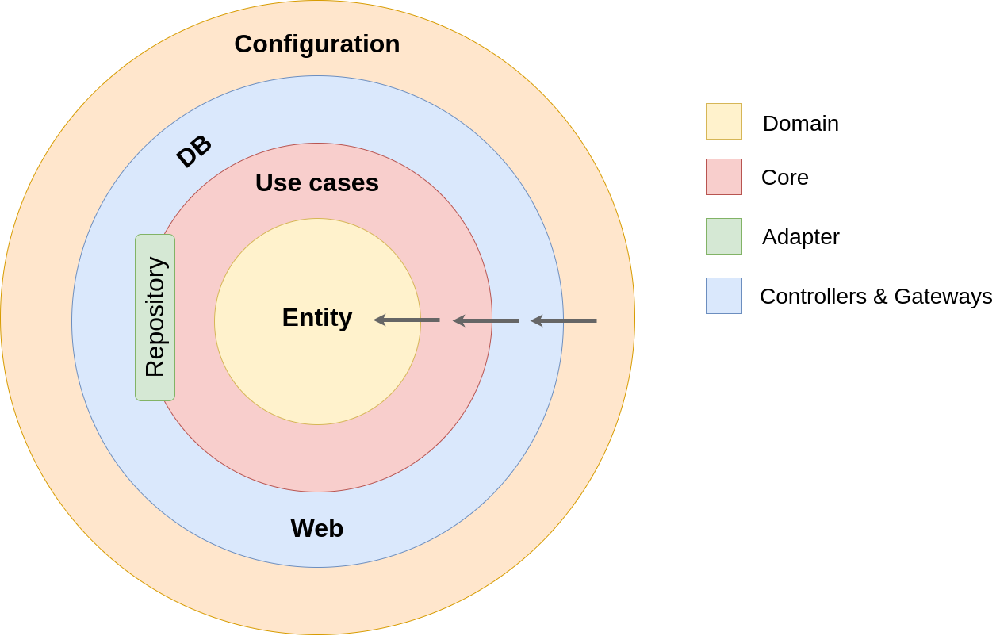
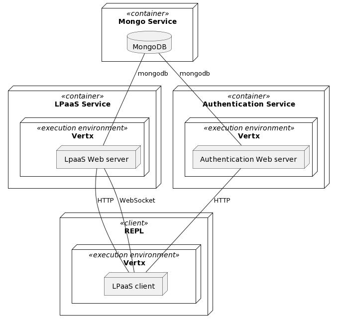

# LPaaS: Logic Programming as a Service

[](https://github.com/lippo97/sd-project/actions/workflows/gradle-build-push.yml)

[Logic Programming as a Service](https://apice.unibo.it/xwiki/bin/view/LPaaS) (LPaaS) is an
evolution of the logic programming (LP) paradigm for intelligent IoT. It is a logic-based,
service-oriented approach for distributed situated intelligence, conceived and designed as the
natural evolution of LP in nowadays pervasive computing systems. Its purpose is to enable situated
reasoning via explicit definition of the spatial-temporal structure of the environment where
situated entities act and interact.

This repository contains an implementation of both a server and a client over HTTP and WebSockets, following [this OpenAPI specification](https://app.swaggerhub.com/apis/unibo-sd/LPaaS/1.0.0#/).

## Repository content

Modules are organized following the [Hexagonal
architecture](https://en.wikipedia.org/wiki/Hexagonal_architecture_(software)) pattern. This way the
components are loosely coupled.



A complete overview of the modules and their dependencies is provided by the following diagram.


The main modules are the following:
- `utils` is the 0-level module and it holds common data structures or algorithms;
- `domain` is the module which models domain objects;
- `core` is the module that uses domain objects to implement domain use cases;
- `delivery-vertx` is the module that uses `vertx-web` in order to map use cases to an HTTP
  interface;
- `persistence-mongo` is the module in which are implemented mongo-based `Repositories`;
- `authentication-vertx` is the module that holds a small authentication logic, based on [JSON Web
  Token](https://en.wikipedia.org/wiki/JSON_Web_Token);
- `client-api` is the module containing an LPaaS client implementation, based on Vert.x `Future`;
- `client-repl` contains an LPaaS terminal-based REPL.

The provided implementations heavily rely on [Vert.x](https://vertx.io/) `Future` in order to
perform asynchronous operations. Nonetheless the `core` module API is defined using `suspend`
functions, in order to adapt to many asynchronous programming paradigms.

## End user setup



A `docker-compose` file is provided in the repository. It declares an example of how the provided
API can be deployed. Its structure is the following:
- `auth` is a node that works as authentication service, it provides clients JSON Web Tokens signed
  with its private key;
- `lpaas` is the core service and to authenticate users it checks if incoming JSON Web Tokens are
  signed using the authentication service public key;
- `mongodb` is a MongoDB instance; it holds data of both authentication and LPaaS services.

In order to setup the LPaaS server using the docker-compose you must provide a pair of RSA keys. [As
the official Vert.X documentation says](https://vertx.io/docs/vertx-auth-jwt/java/#_using_rsa_keys),
in order for the standard JDK to read the file, you must convert it to PKCS8 format first. For the
sake of the demo a `generate_keys.sh` script is provided in the repository. It will generate a RSA
key pair into the `generated-keys` directory.

``` sh
$ ./generate_keys.sh 
Generating RSA private key, 2048 bit long modulus (2 primes)
..................................................................................+++++
...................+++++
e is 65537 (0x010001)
writing RSA key
Keys generated successfully.
$ ls generated-keys 
private.pkcs8.pem  public.pem
$ docker-compose up
```

## Reference publication
  
``` bibtex
@article{lpaas-tplp18,
    Author = {Calegari, Roberta and Denti, Enrico and Mariani, Stefano and Omicini, Andrea},
    Doi = {10.1017/S1471068418000364},
    Editor = {Fioretto, Ferdinando  and Pontelli, Enrico},
    Journal = {Theory and Practice of Logic Programming},
    Keywords = {logic programming, distributed systems, service-oriented architectures, pervasive systems, intelligent systems, LPaaS, situatedness},
    Month = sep,
    Note = {Special Issue ``Past and Present (and Future) of Parallel and Distributed Computation in (Constraint) Logic Programming''},
    Number = {5-6},
    Pages = {846--873},
    Publisher = {Cambridge University Press},
    ScholarId = {13482792136370336832},
    ScopusId = {2-s2.0-85050006559},
    Title = {Logic Programming as a Service},
    Url = {https://www.cambridge.org/core/journals/theory-and-practice-of-logic-programming/article/logic-programming-as-a-service/8A8109052E2F9EC177332F36183E80BE},
    Volume = 18,
    WosId = {000443682000005},
    Year = 2018
}
```

